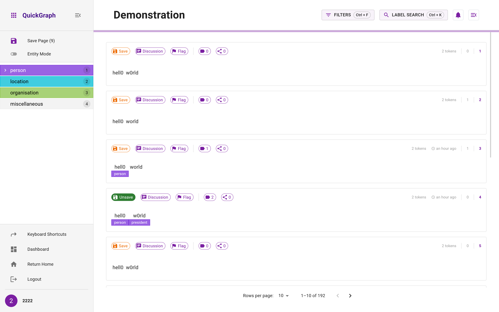

<div style="display:flex;align-items:center;flex-direction:row;justify-content:center">

<h1>QuickGraph</h1>
</div>

### A Rapid Annotation Tool for Knowledge Graph Extraction from Technical Text

[](https://quickgraph.tech)
[](https://youtu.be/DTWrR67-nCU)
[](https://docs.quickgraph.tech)


> [!IMPORTANT]
> QuickGraph v2 is currently being rolled out 🚧
> We're actively migrating to version 2, with completion expected by November 11th, 2024. The core features and workflow demonstrated in v1 remain relevant as they form the foundation of v2. This update is mainly architecture and user interface updates only.

<div>
  
</div>

## 📚 Table of Contents
- [Overview](#-overview)
- [Features](#-features)
- [Getting Started](#-getting-started)
  - [Prerequisites](#prerequisites)
  - [Installation](#installation)
- [Architecture](#-architecture)
- [Usage](#-usage)
- [Contributing](#-contributing)
- [License](#-license)
- [Contact](#-contact)

## 🌟 Overview

QuickGraph is a collaborative annotation tool for rapid multi-task information extraction. It features entity and relation propagation which mimics weak supervision, and uses text clustering to aid with annotation consistency.

## ✨ Features

- Entity and relation propagation
- Text clustering for annotation consistency
- Multi-user collaboration support
- Real-time knowledge graph creation from annotations
- Interactive visualization
- Comprehensive analytics dashboard

## 🚀 Getting Started

### Prerequisites
[](https://www.docker.com/)
[](https://reactjs.org/)
[](https://fastapi.tiangolo.com/)
[](https://www.mongodb.com/)

- Docker and Docker Compose
- Git
- Node.js 16+ (for local development only)
- Python 3.10+ (for local development only)

### General Installation

1. Clone the repository:
```bash
git clone https://github.com/nlp-tlp/quickgraph.git
cd quickgraph
```

2. Build and run using Docker Compose:
```bash
docker compose up --build
```

The services will be available at:
- Frontend: http://localhost:3000
- Backend API: http://localhost:8000
- Documentation: http://localhost:4000
- MongoDB: localhost:27018

### Development Installation

Need to run client and fastapi server locally; can run docker container for mongodb separately. But FastAPI is run in `./server` through `uvicorn src.quickgraph.main:app --reload`. Client is run from `./client` via `npm run dev`. Both of these need to have local `.env` files set up as outlined below.

2. Set up environment variables:
```bash
# Copy sample environment files
cp server/.env.example server/.env
cp client/.env.example client/.env
```

For `client/.env` these can remain as defaults

```
VITE_API_BASE_URL=http://localhost:8000
VITE_DOC_BASE_URL=http://localhost:4000
```

For `server/.env`, create a atlas or locally hosted mongodb:
```
MONGODB__DATABASE_NAME="your_database_name"
MONGODB__URI="mongodb+srv://..."
AUTH__SECRET_KEY="your_secret"
```

## 🏗 Architecture

QuickGraph consists of four main components:
- Frontend: Vite/React application
- Backend: FastAPI REST API
- Documentation: Docusaurus static site
- Database: MongoDB

## 🎯 Usage

Once the docker containers have been set up, simply run `docker compose up` then navigate to `http://localhost:3000` in your browser to use QuickGraph.


## 🤝 Contributing

Contributions are welcome! Please feel free to submit a Pull Request. For major changes, please open an issue first to discuss what you would like to change.

## 📄 License
This project is licensed under the MIT License - see the LICENSE file for details.

## 📬 Contact
Tyler Bikaun - tyler.bikaun@research.uwa.edu.au


## 📚 Citation

If you use QuickGraph in your research, please cite our [paper](https://aclanthology.org/2022.acl-demo.27.pdf):

```
@inproceedings{bikaun2022quickgraph,
  title={Quickgraph: A rapid annotation tool for knowledge graph extraction from technical text},
  author={Bikaun, Tyler and Stewart, Michael and Liu, Wei},
  booktitle={Proceedings of the 60th Annual Meeting of the Association for Computational Linguistics: System Demonstrations},
  pages={270--278},
  year={2022}
}

```
